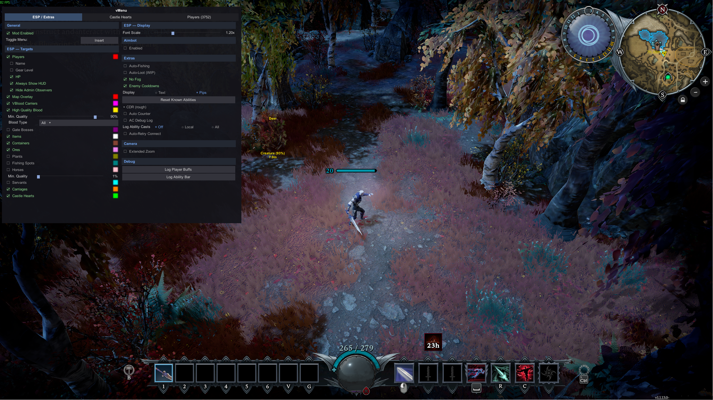

# VMenu

In-game BepInEx menu for [V Rising](https://store.steampowered.com/app/1604030/V_Rising/).

Built on [LeonardoVAC/VRising-Menu](https://github.com/leonardovac/VRising-Menu) (ExtrasensoryPerception). Licensed under AGPL-3.0 — see `LICENSE.txt`.

## Screenshots



## Installation

1. Install [BepInEx IL2CPP](https://github.com/BepInEx/BepInEx) for V Rising.
2. Build from source, or use a compiled `ExtrasensoryPerception.dll`.
3. Copy the DLL to `...\VRising\BepInEx\plugins`.
4. Launch the game. Toggle the menu with **Insert**.

## Usage

<!-- Add usage notes here -->

## Features

- **Aimbot**
  - Players, bosses, mobs
  - Hold / toggle, dual keys, distance and cursor limits

- **ESP**
  - Players (name, gear, HP, always-on HUD, hide admin observers)
  - Minimap / world map overlay
  - VBlood carriers, high-quality blood, gate bosses
  - Items, containers, ores, plants, fishing spots
  - Horses, servants, carriages, castle hearts

- **Enemy cooldowns**
  - Text or pip display on enemy ESP
  - Rough CDR for counters and veils

- **Auto Counter**
  - Fires equipped counter / barrier spells against tracked enemy skills
  - Per-skill toggles, activation lag, target radius

- **Players**
  - Steam ID name history and original-name lookup

- **Extras**
  - Auto-fishing, auto-loot (WIP), no fog
  - Auto-retry on Server Full
  - Extended camera zoom

## Build

```bash
dotnet build -c Release
```

Output: `src/bin/Release/net6.0/ExtrasensoryPerception.dll`

## Acknowledgements

- [LeonardoVAC](https://github.com/leonardovac/VRising-Menu) for VRising-Menu / ExtrasensoryPerception.
- [m3tal_dragon](https://www.unknowncheats.me/forum/members/245538.html) for the original [Vampitizer](https://www.unknowncheats.me/forum/other-mmorpg-and-strategy/584727-vampitizer-rising-cheat.html) release.
- [irfn](https://www.unknowncheats.me/forum/members/5581085.html) and [Skybro](https://www.unknowncheats.me/forum/members/1645846.html) for updated Vampitizer builds.
- [SkyTech6](https://github.com/SkyTech6) and [mfoltz](https://github.com/mfoltz) for useful resources.
